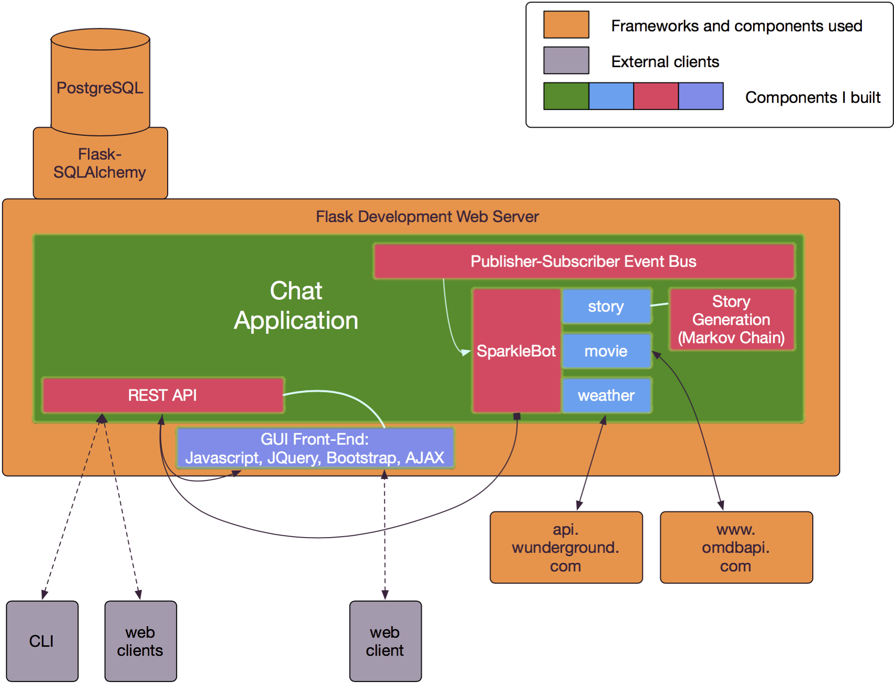

# hb-chatty

# Chatty

Chatty is a web app, created by Nija Mashruwala, which is used to chat with other users and an interactive chat bot. It is architected to mimic most enterprise production web microservices.

Learn more about the developer [here](https://www.linkedin.com/in/nmashruwala).

## Contents
- [Technologies Used](#technologiesused)
- [Features](#features)
- [Infrastucture](#infrastructure)
- [APIs](#apis)
- [Event Bus](#eventbus)
- [Reliability](#rely)

## Technologies Used
- [Python](https://www.python.org/)
- [PostGreSQL](https://www.postgresql.org/)
- [Flask](http://flask.pocoo.org/)
- [Flask-SQLAlchemy](http://flask.pocoo.org/)
- [jQuery](https://jquery.com/)
- [Bootstrap](http://getbootstrap.com/)
- [Open Movie Database API](http://www.omdbapi.com/)
- [Wunderground API](https://www.wunderground.com/weather/api/)

## Features

*Current*

- [X] REST API for all server interactions
- [X] Chatbot responds to basic politeness
- [X] Chatbot retrives weather information
- [X] Chatbot retrieves movie information
- [X] Chatbot comes with a help feature
- [X] Basic end-to-end ping-type healthcheck exists
- [X] Extensive monitoring healthcheck exists
- [X] Multi-users and multi-client 
- [X] All screens are updated in close to real-time
- [X] GUI works on mobile clients; site is responsive
- [X] Multiple ways to retrive new messages - by last updated time and by the last n messages

*Future*

- [ ] Upgrade to Python3
- [ ] The app will go through basic security hardening
- [ ] Users will be able to tell Chatbot to remind them of events
- [ ] GUI will have a log in flow
- [ ] Data rentention is enforced

## Infrastructure
Chatty is implemented with a microservice architecture pattern. Because of the uncoupled design, it's trivial to separate the event bus or chatbot for placement on external hosts, or allocate a separate process to handle each component. As the chat data is designed to be ephemeral, and the chat server will recreate the database schema when necessary, no data recovery steps are needed.

## APIs
Chatty has a full-featured and robust REST API, which allows for command-line interactions, development of third-party custom clients, and extra functionality not seen on the front-end GUI (user creation, room creation, etc). The bot uses Chatty's API to post responses. 

The chat bot uses the Wunderground API to display weather information by zipcode and the Open Movie Database API to display movie information. The chat bot can also generate natural language stories using Markov Chains. This implementation uses Alice in Wonderland and Through the Looking Glass as story data.

## Event Bus
The chat server uses a custom, one-way Publish-Subscribe event bus to communicate events to the bot. The chat server publishes an event to the bus, which then handles the distributionof the event to the listeners subscribed to the event type. Currently, the bot is the only listener.

## Reliability
The web app is close to production-ready in that monitoring and healthcheck hooks exist, code coverage is around 80%, and continuous integration has been set up. The last steps are to lock down parts of the API, and set up continuous deployment using Travis-CI and Heroku.

